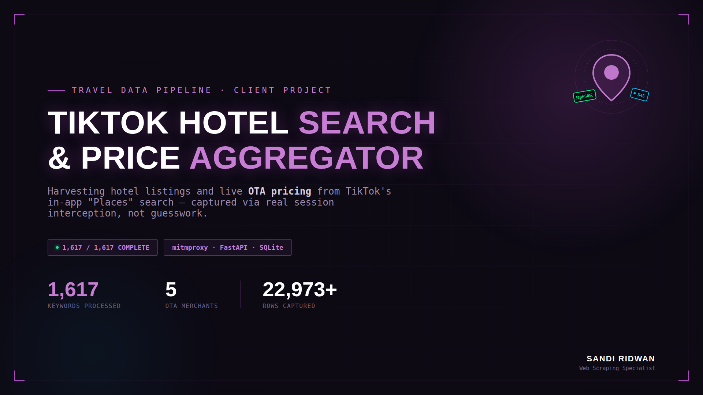

<div align="center">


<br/>


</div>

---

```
╔══════════════════════════════════════════════════════════════════════════╗
║                                                                          ║
║        📍  T I K T O K   H O T E L   S E A R C H   A G G R E G A T O R  ║
║                                                                          ║
║     keyword ──▶ search/place/ ──▶ hotel + OTA price ──▶ SQLite           ║
║                                                                          ║
║      1,617 keywords  ·  Multi-country  ·  Live progress monitor         ║
╚══════════════════════════════════════════════════════════════════════════╝
```

---

## 🎬 Demo

<div align="center">
  <a href="#">
    
  </a>
  <br/>
  <sub><i>Click to watch — live terminal monitor, sample query run, CSV export walkthrough</i></sub>
</div>

<br/>

<div align="center">
  <video src="https://github.com/user-attachments/assets/e1d7d310-0660-492e-94d2-0d5f10c03730"
         width="860"
         controls>
  </video>
  <br/>
  <sub><i>Full walkthrough — keyword run, live dashboard, final dataset</i></sub>
</div>

---

## 🧠 Overview

**TikTok Hotel Search & Price Aggregator** discovers and harvests hotel and accommodation listings surfaced by TikTok's in-app "Places" search tab, capturing live OTA pricing (Trip.com, Agoda, Traveloka, tiket.com, Rakuten Travel) for **1,617 location-based keywords** across Indonesia and parts of Asia — without ever touching TikTok's public web scraper-unfriendly surface. The session and device fingerprint used to talk to TikTok's private mobile API were captured directly from real app traffic via mitmproxy, not faked from scratch.

<div align="center">

| Metric | Value |
|-------:|:------|
| 🔑 Keywords Processed | **1,617 / 1,617 — 100% complete** |
| 🏨 Target | TikTok Search → "Places" tab (hotel/accommodation results) |
| 💰 Price Sources Captured | Trip.com · Agoda · Traveloka · tiket.com · Rakuten Travel |
| 🌏 Coverage | Indonesian cities + select Asia (Krabi, Yokohama, Chiang Mai, George Town) |
| 🔐 Session Method | mitmproxy traffic capture → real `sessionid` / `device_id` / `install_id` |
| 🧩 Signature Layer | Local FastAPI RPC sign server — documented as a lightweight signature stand-in, not a cryptographic crack |
| 🗄️ Storage | SQLite WAL mode · dedup on `(poi_id, merchant)` · per-keyword checkpoint/resume |
| 📊 Live Monitoring | Terminal dashboard, 3-second refresh, zero scraper downtime to check progress |
| 📁 Export | One-command CSV export, full dataset, ready for client handoff |

</div>

---

## 🏗️ Architecture

```
┌──────────────────────────────────────────────────────────────────────┐
│                     SIGN SERVER (FastAPI · :8080)                    │
│         POST /sign  →  { X-Gorgon, X-Khronos } per request           │
└──────────────────────────────┬───────────────────────────────────────┘
                               │
                               ▼
┌──────────────────────────────────────────────────────────────────────┐
│                    MASS SCRAPER (tiktok_mass_scraper)                │
│   real session (sessionid/device_id from mitmproxy capture)          │
│   + signed headers from Sign Server                                  │
│   → GET search/place/?keyword=...&offset=N                          │
│   → loop offset until empty response                                 │
└──────────────────────────────┬───────────────────────────────────────┘
                               │
                               ▼
┌──────────────────────────────────────────────────────────────────────┐
│                        SQLite (WAL mode)                             │
│   data_hotel — hotel + merchant price rows, UNIQUE(poi_id, merchant) │
│   progres_keyword — checkpoint table, resume-safe on restart         │
└──────────────────────────────┬───────────────────────────────────────┘
                               │
                  ┌────────────┴─────────────┐
                  ▼                          ▼
        monitor_live.py              export_csv.py
        (3s refresh dashboard)       (full dataset → CSV)
```

---

## ⚡ Technical Challenges Solved

### Challenge 1 — TikTok's Private Mobile API Has No Public Docs

**Problem:** The "Places" tab inside TikTok's in-app search isn't a public API — there's no documentation, no SDK, and the request needs device identity and signed headers a browser-based scraper simply doesn't have.

**Solution:** Captured real app traffic with **mitmproxy** while manually performing the exact user action (search a hotel keyword, tap the Places tab) on an Android device/emulator. This surfaced the real endpoint, the exact query parameters, and a working session — the foundation everything else was built on.

```python
# Session values captured from intercepted traffic — not guessed.
# Replace with your own captured values via environment variables, never hardcode.
SESSION_ID = os.getenv("TIKTOK_SESSION_ID")
HEADERS = {
    "Cookie": f"sessionid={SESSION_ID}; install_id=...; store-country-code=id;",
    "User-Agent": "<exact official app UA captured via mitmproxy>",
}
```

---

### Challenge 2 — Signature Header Requirement (`X-Gorgon`)

**Problem:** TikTok's mobile endpoints expect a signed `X-Gorgon` / `X-Khronos` header pair. The real algorithm lives in native C++ (`libcms.so`) — fully reverse-engineering it requires tools like Unidbg or Frida, which was outside this project's scope and timeline.

**Solution:** Built a small local FastAPI "sign server" that generates a stand-in signature. It turned out the Places endpoint accepts this as long as the **session and device identity are real** — captured from the mitmproxy traffic, not the signature itself. This is documented transparently in the code as a lightweight technique, not a claim of a full cryptographic break.

```python
# sign_server.py — local RPC, NOT a cryptographic reverse-engineering of X-Gorgon
@app.post("/sign")
def generate_mock_gorgon(url: str, ts: int):
    # Lightweight signature stand-in — works because the session/device
    # identity (captured via mitmproxy) carries the real trust signal.
    # A full native implementation (libcms.so via Unidbg) is a documented
    # next step, not what's running here.
    return {"X-Gorgon": hashlib.md5(f"{url}{ts}salt".encode()).hexdigest()}
```

---

### Challenge 3 — Mid-Project Schema Migration Without Losing Progress

**Problem:** Partway through the 1,617-keyword run, the schema needed two changes — `offset_ke` replaced with a proper `nomor_urut` ranking column, plus a new `harga_asli` (pre-discount price) column. Hundreds of keywords failed to save with `no column named offset_ke` before the fix landed.

**Solution:** Rebuilt the `data_hotel` table with the final 14-column schema, then reset the `progres_keyword` checkpoint table so every keyword that failed pre-fix was automatically retried on the next run — no manual list of "what failed" needed.

```python
# Reset checkpoint — failed keywords before the schema fix get retried automatically
cursor.execute("DELETE FROM progres_keyword")
conn.commit()
# Next run re-attempts every keyword not yet marked complete
```

---

### Challenge 4 — Long-Running Job Needs Visibility Without Downtime

**Problem:** A 1,617-keyword run takes a long time. Stopping the scraper just to check progress wastes hours of runtime.

**Solution:** A standalone `monitor_live.py` polls the same SQLite database every 3 seconds and prints a clean terminal dashboard — total hotels, keywords completed, unique merchants, and the latest rows — while the scraper keeps running untouched.

```python
while True:
    cursor.execute("SELECT COUNT(*) FROM data_hotel")
    total_hotel = cursor.fetchone()[0]
    cursor.execute("SELECT COUNT(*) FROM progres_keyword")
    keywords_done = cursor.fetchone()[0]
    os.system("cls" if os.name == "nt" else "clear")
    print(f"Hotels: {total_hotel} | Keywords done: {keywords_done}/1617")
    time.sleep(3)
```

---

## 📁 File Structure

```
tiktok-hotel-aggregator/
├── tiktok_mass_scraper.py    # ⭐ Main scraping engine — keyword loop + pagination
├── sign_server.py            # FastAPI RPC — local signature stand-in
├── tiktok_api_client.py      # Request builder — headers, params, session
├── database_setup.py         # Schema creation — data_hotel + progres_keyword
├── upgrade_db.py              # Schema migration helper (ALTER TABLE)
├── reset_db.py                 # Checkpoint reset for re-runs
├── monitor_live.py            # Live terminal dashboard, 3s refresh
├── export_csv.py               # One-command full dataset → CSV
├── check_db.py                  # Quick DB sanity check
├── target_hotel_keywords.csv  # Keyword list — city + scroll depth
├── tiktok_data_center.db       # SQLite output (WAL mode)
└── README.md
```

---

## 🚀 Quick Start

### 1. Install

```bash
git clone https://github.com/sandiridwan/tiktok-hotel-aggregator.git
cd tiktok-hotel-aggregator
python -m venv venv && source venv/bin/activate  # Windows: venv\Scripts\activate
pip install -r requirements.txt
```

### 2. Configure Session

```bash
# Capture your own session via mitmproxy, then set:
export SESSION_ID="your_captured_sessionid"
export DEVICE_ID="your_captured_device_id"
```

### 3. Run

```bash
# Start the local sign server
python sign_server.py &

# Run the scraper against your keyword list
python tiktok_mass_scraper.py

# In a second terminal — watch live progress
python monitor_live.py

# When done — export everything to CSV
python export_csv.py
```

---

## 📊 Live Run Results

```
Run summary — TikTok Hotel Search & Price Aggregator

✅ Keywords processed     1,617 / 1,617  —  100% complete
✅ Hotel + price rows     22,973+ (last documented checkpoint, final count higher)
✅ Merchants captured     Trip.com · Agoda · Traveloka · tiket.com · Rakuten Travel
✅ Dedup                  UNIQUE(poi_id, merchant) — zero duplicate rows
✅ Schema migration       Recovered cleanly mid-run, zero data loss on retry
──────────────────────────────────────────────────────────────
   Status: Completed · Delivered to client
```

---

## 🛠️ Tech Stack

<div align="center">

| Layer | Technology |
|-------|------------|
| **Language** | Python 3.12 |
| **Traffic Capture** | mitmproxy — real session/device identity extraction |
| **Signature Layer** | FastAPI — local RPC sign server |
| **HTTP Client** | requests, with real captured session headers |
| **Database** | SQLite — WAL mode, checkpoint-resume pattern |
| **Monitoring** | Custom terminal dashboard (3s polling) |
| **Export** | csv module — on-demand full dataset dump |

</div>

---

## 📝 Lessons Learned

1. **Session identity beats signature complexity for some endpoints** — a real `sessionid` and device fingerprint carried more trust than a perfectly-formed but fake signature. Always check what's actually being validated before reaching for the hardest possible solution.
2. **mitmproxy is the fastest path to understanding an undocumented mobile API** — watching one real request beats hours of guessing parameter names.
3. **Honesty about technique scope matters** — labeling a signature stand-in as exactly that (not a cryptographic break) keeps the work defensible if a client or reviewer asks for technical detail.
4. **Checkpoint tables save long-running jobs** — a single schema mismatch mid-run didn't cost a restart from zero; the checkpoint reset made recovery automatic.
5. **A live dashboard pays for itself on long jobs** — no need to halt a multi-day scrape just to check how far along it is.

---

## 👤 Author

<div align="center">


**Data Automation Engineer · Web Scraping Specialist · AI Automation Builder**

📍 Palu, Central Sulawesi, Indonesia

[](https://www.upwork.com/freelancers/sandiridwan)
[](https://linkedin.com/in/sandi-ridwan)
[](https://github.com/SandiRidwan)

</div>

---

<div align="center">

</div>

---

## 📄 License

MIT License — Educational and client-delivery purposes.
